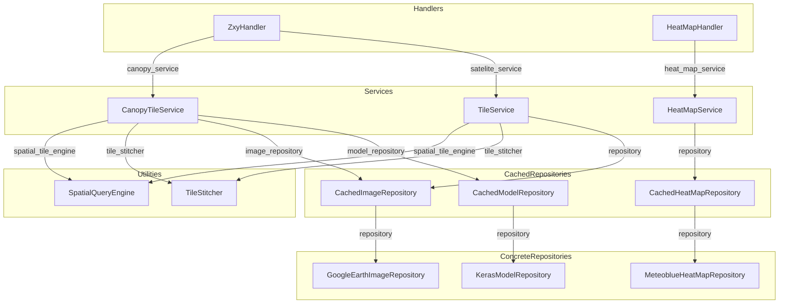
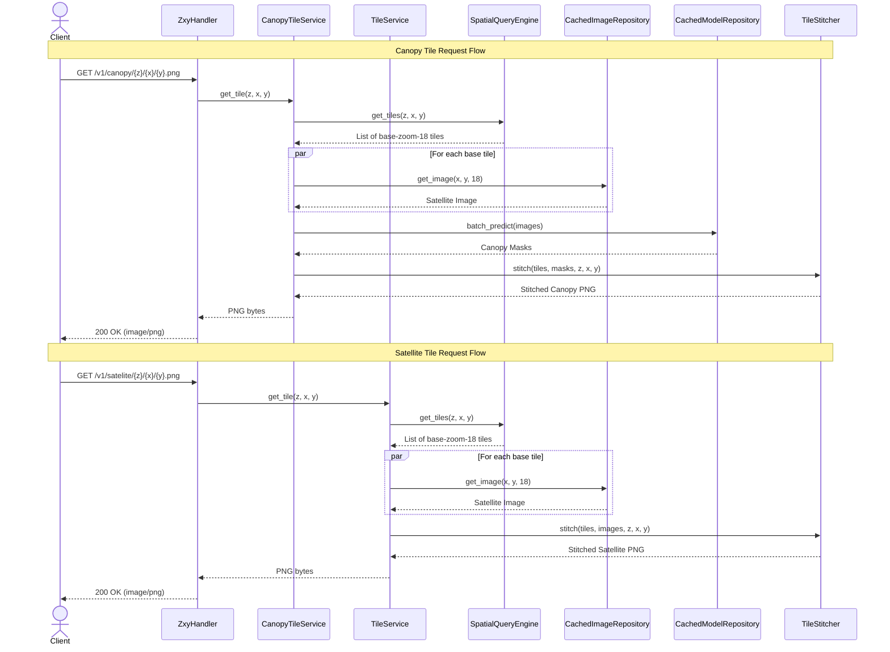
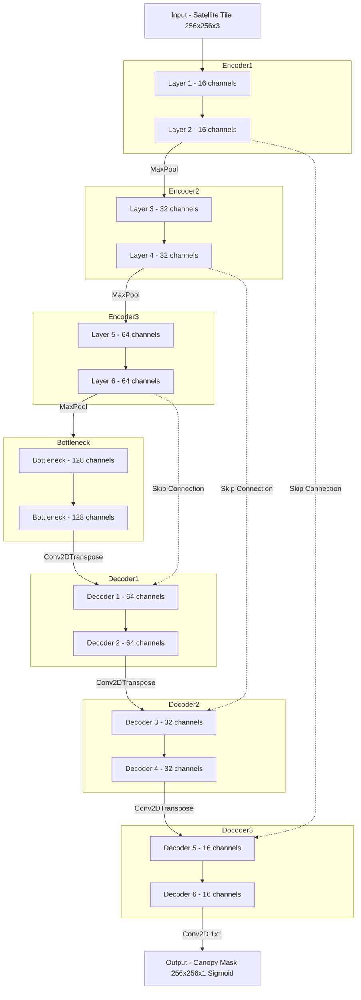

# Satellite Canopy Monitor

A geospatial intelligence platform that combines **Google Earth satellite imagery**, a **U-Net deep learning model** for tree canopy detection and **Meteoblue heat-map overlays**.

The core of the system is the **Tile API** — a FastAPI-powered map tile server that streams satellite tiles, AI-generated canopy masks, and temperature data to any standard map viewer.

---

## Table of Contents

- [Overview](#overview)
- [Tile API](#tile-api)
  - [Architecture](#architecture)
  - [API Endpoints](#api-endpoints)
  - [Tile Request Flow](#tile-request-flow)
  - [Handlers](#handlers)
  - [Application Services](#application-services)
  - [Repositories and Caching](#repositories-and-caching)
- [U-Net Canopy Model](#u-net-canopy-model)
- [Running the Project](#running-the-project)

---

## Overview

The platform answers one question: **how does urban tree cover influence neighbourhood-level temperature in Athens?**

It does so by:

1. Fetching high-resolution satellite tiles from Google Earth at zoom level 18.
2. Running each tile through a custom **U-Net autoencoder** to produce a binary tree-canopy mask.
3. Overlaying Meteoblue city-scale temperature heat maps.

Google Earth and canopy layers are served as standard **XYZ map tiles** so any mapping library (Leaflet, Folium, MapLibre…) can consume them directly.

---

## Tile API

### Architecture

The Tile API follows a clean **3-layer hexagonal architecture**:

| Layer | Responsibility |
|---|---|
| **Handlers** | Parse HTTP requests, call services, return responses |
| **Application** | Business logic — coordinate translation, batching, stitching |
| **Repositories** | Data access — Google Earth, Keras inference, JSON, Meteoblue |



All inter-layer dependencies flow **inward** through abstract interfaces defined in `repositories.py`, making each layer independently testable and swappable.

---

### API Endpoints

| Method | Path | Description |
|--------|------|-------------|
| `GET` | `/v1/satelite/{z}/{x}/{y}.png` | Raw satellite tile (Google Earth imagery) |
| `GET` | `/v1/canopy/{z}/{x}/{y}.png` | AI-generated tree canopy mask tile |
| `GET` | `/v1/heat-map/{city}/{time}.webp` | Meteoblue temperature heat-map image |

#### Tile URL format

Tiles use the industry-standard **ZXY (Slippy Map)** coordinate scheme:

```
/v1/canopy/{z}/{x}/{y}.png
         ↑   ↑   ↑
         │   │   └── Tile row (Y)
         │   └────── Tile column (X)
         └────────── Zoom level (0–20)
```

The server is pinned to a **base zoom of 18** for inference. Requests at other zoom levels are automatically translated.

#### Heat-map URL format

```
GET /v1/heat-map/athens/2026-06-28T22%3A00%3A00%2B00%3A00.webp
```

The `{time}` segment is a URL-encoded ISO 8601 datetime string passed directly to the Meteoblue City Climate API.

---

### Tile Request Flow



---

### Handlers

Handlers live in `tile_api/handlers/` and are thin — they only validate inputs, call a service, and format the HTTP response.

#### `ZxyHandler`

```python
GET /v1/satelite/{z}/{x}/{y}.png  →  TileService.get_tile(z, x, y)
GET /v1/canopy/{z}/{x}/{y}.png    →  CanopyTileService.get_tile(z, x, y)
```

Returns `image/png` or `404` if the tile could not be assembled.

#### `HeatMapHandler`

Proxies the Meteoblue City Climate API, caches the result, and returns it as `image/jpeg`.

---

### Application Services

All services and engines live in `tile_api/application/`.

#### `SpatialQueryEngine`

Translates any `(z, x, y)` tile request into a list of `Tile` objects at the fixed **base zoom 18**:

```python
class SpatialQueryEngine:
    def __init__(self, base_zoom: int = 18): ...
    def get_tiles(self, z, x, y) -> list[Tile]: ...
```

| Requested zoom | Strategy |
|---|---|
| `z == base_zoom` | Returns `[Tile(18, x, y, diff=0, scale=1)]` |
| `z < base_zoom` | Generates a `2^diff × 2^diff` grid of tiles to stitch |
| `z > base_zoom` | Returns the single parent tile; stitcher crops it |

#### `TileStitcher`

Assembles 256×256 output PNG from a list of fetched tile images:

- **Lower zoom** → creates a blank canvas, resizes each sub-tile to `256 / scale` pixels and pastes at the correct offset
- **Higher zoom** → crops the `sub_size × sub_size` quadrant from the base tile and upscales to 256×256 using Lanczos resampling

#### `TileService` / `CanopyTileService`

`TileService` returns raw satellite PNGs. `CanopyTileService` additionally:

1. Passes fetched tile bytes through `IModelRepository.batch_predict()`
2. Stitches the resulting **canopy mask** images instead of the raw tiles

Both services use `ThreadPoolExecutor` to fetch tiles in parallel and gracefully degrade (up to 20 individual tile failures before aborting).

---

### Repositories and Caching

The caching strategy is a **decorator pattern**: cached repositories wrap real repositories and add a disk-persistence layer.

```
Request
   │
   ▼
CachedImageRepository  ──(cache miss)──▶  GoogleEarthImageRepository
   │                                              │
   │◀──────────────────(write to disk)────────────┘

CachedModelRepository  ──(cache miss)──▶  KerasModelRepository (U-Net)
   │                                              │
   │◀──────────────────(write to disk)────────────┘
```

#### `GoogleEarthImageRepository`

Fetches 256×256 PNG satellite tiles from Google's tile CDN:

```
https://mt1.google.com/vt/lyrs=s&x={x}&y={y}&z={z}
```

#### `CachedImageRepository`

Saves tiles to `.tile_cache/{z}_{x}_{y}.png`. On subsequent requests the file is read from disk — no network call needed.

#### `KerasModelRepository`

Loads `tree_mask_autoencoder_model.keras` and runs inference in a `ProcessPoolExecutor` (separate OS processes to bypass the Python GIL). Images are batched in chunks of 8. The output is a binary PNG mask (`> 0.5` threshold on sigmoid output).

#### `CachedModelRepository`

Saves each canopy mask to `.canopy_cache/{sha256_of_input}.png`. The cache key is the SHA-256 hash of the raw input tile bytes, so identical tiles always reuse the cached prediction.

#### `MeteoblueHeatMapRepository` / `CachedHeatMapRepository`

Fetches `.webp` heat-map images from the Meteoblue City Climate API and caches them in `.heatmap_cache/`.

---

## U-Net Canopy Model

The canopy detection model is a custom **U-Net** implemented in TensorFlow/Keras, defined in `repositories/model.py`.



- **Input**: 256×256×3 RGB satellite tile (normalised to [0, 1])
- **Output**: 256×256×1 binary mask — white = tree canopy, black = non-canopy
- **Skip connections**: encoder feature maps are resized and concatenated with decoder activations to preserve spatial detail
- **Threshold**: sigmoid output `> 0.5` is treated as positive (tree)

The trained model weights are stored in `models/tree_mask_autoencoder_model.keras` (~5.6 MB). The training notebooks are in `notebooks/`.

---

## Running the Project

### Prerequisites

- Python 3.10+
- TensorFlow 2.x
- FastAPI + Uvicorn
- Pillow, OpenCV, NumPy
- Streamlit, Folium, streamlit-folium

### Start the Tile API

```bash
# From the workspace root
uvicorn tile_api.app:app --host 0.0.0.0 --port 8000 --reload
```

The API will be available at `http://localhost:8000`. Interactive docs at `http://localhost:8000/docs`.

### Start the Streamlit Viewer

```bash
# In a separate terminal, from the workspace root
streamlit run streamlit_app.py
```

### Caches

The three cache directories are created automatically on first run:

| Directory | Contents |
|---|---|
| `.tile_cache/` | Satellite tile PNGs, named `{z}_{x}_{y}.png` |
| `.canopy_cache/` | Canopy mask PNGs, named `{sha256}.png` |
| `.heatmap_cache/` | Meteoblue heat-map WebP images |

To force fresh downloads/inference, delete the relevant cache directory.

---
